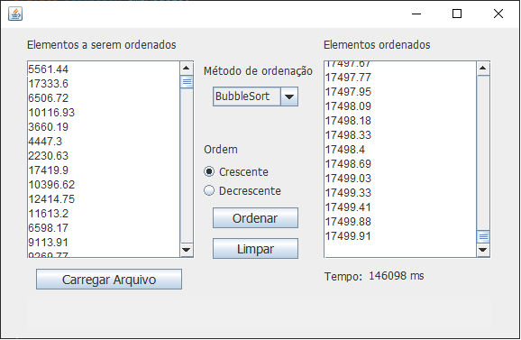

<h1 align="center"> Sistema de ordenação de salários </h1>

  

 Projeto desenvolvido com Java.
 

  <a href="#-sobre-o-projeto">Sobre o projeto</a>&nbsp;&nbsp;&nbsp;|&nbsp;&nbsp;&nbsp; 
  <a href="#-layouts">Layouts</a>&nbsp;&nbsp;&nbsp;|&nbsp;&nbsp;&nbsp;
  <a href="#-requisitos-e-recomendações">Requisitos e recomendações</a>&nbsp;&nbsp;&nbsp;&nbsp;&nbsp;&nbsp;

</img>

# 💻 Sobre o projeto 

 Projeto criado para a matéria "Projetos de software". A proposta é desenvolver um sistema que ordene uma lista de salários qualquer onde o usuário pode escolher o método de ordenação. O objetivo é desenvolver segundo todos os princípíos de projetos de software (SOLID). Segue em anexo os requisitos solicitados pelo professor:

 <a href="https://docs.google.com/document/d/1-Wdd9cuvDxn7QWEFMWKTe3yZi-zy0f5UfKpri4_KGBU/edit">Requisitos solicitados</a>
  
# 📸 Layouts 

<h3 align="center">Tela pricipal do sistema</h3>

</img>

 
  

# 📝 Requisitos e recomendações

REQUISITOS:
- Java 11

RECOMENDAÇÕES:
- O arquivo-exemplo com uma quantidade boa de salários está em "\Ordenacao_Salarios\src\main\java\com\yves\projetoordenacao\salarios.csv" dentro do projeto. Se quiser testar o sistema, acesse-o no botão "Carregar Arquivo".
  
# ✒️ Autor

Yves Lima Silva

<a href="https://www.linkedin.com/in/yves-lima-b63b2515b/"> Linkedin </a>

